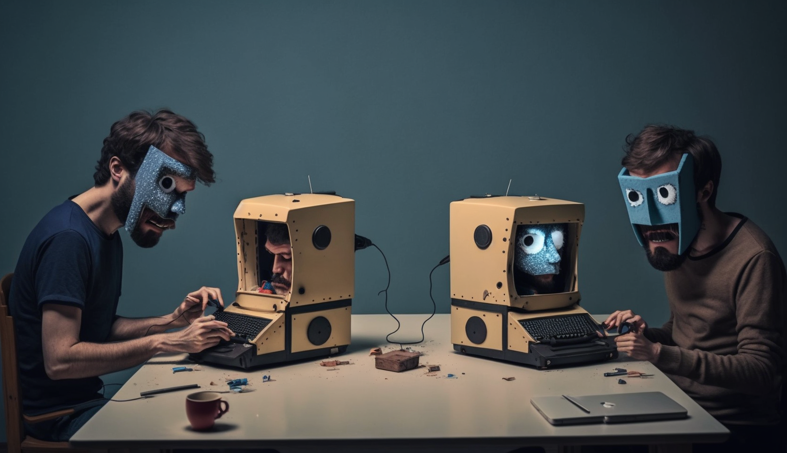

<!-- For Printing
-->

**Daniel Schmocker**, Molekularbiologe mit langjähriger Erfahrung in der Arbeit mit Kindern und Jugendlichen. Arbeitet als Lehrer in Ostermundigen.
[E-Mail](mailto:daniel.b.schmocker@gmail.com)

**Simon Flückiger**, Sozial- und Medienpädagoge in Ausbildung. Arbeitet als Jugendarbeiter in Zollikofen.
[E-Mail](mailto:si.flueckiger@gmail.com)

Angefangen mit der Produktion von Musikvideos und später durch eigene diverse Makerprojekte für Kunstinstallationen haben wir uns, ganz nach der Philosophie des *Learning by doing* oder eben *Learning by making*, eine Menge Wissen über die digitale Welt autodidaktisch und intrinsisch motiviert angeeignet.

> "Wir machen gerne Dinge, die wir nicht können."
> 
> — *Daniel und Simon, seit 2017*

Während unseres Schaffens haben wir erfahren, wie viel Potenzial im projekt- und eventorientierten Lernen steckt. Daraus ist die Idee entstanden, für Kinder und Jugendliche durch kooperative Maker-Projekte das Lernen erlebbar zu machen. Als Folge davon haben wir unser Prototyp-Projekt *Puzzle Palooza* entwickelt, das wir hier vorstellen möchten.